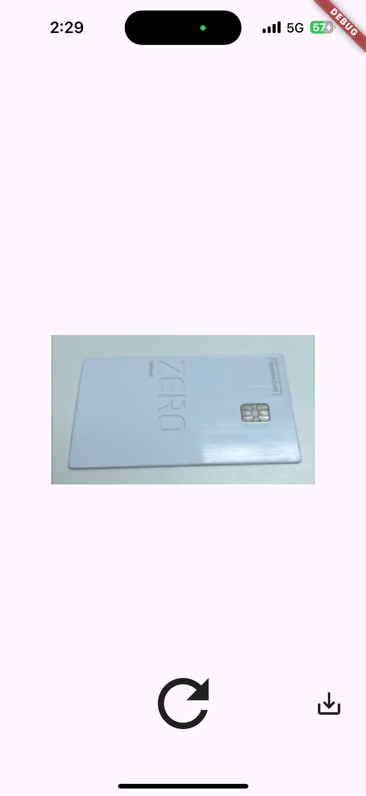
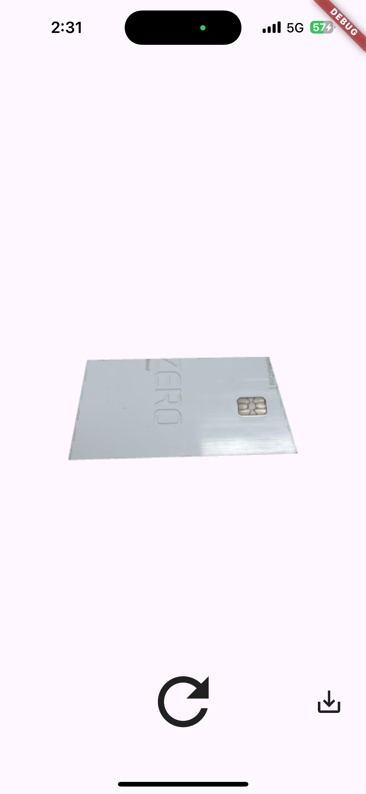

# Picture Cropper

[](https://opensource.org/licenses/MIT)
[](https://github.com/jhk-im)

A Flutter package for cropping pictures, which includes features for capturing images from the camera or selecting images from the gallery.

### Rectangle Crop
<p>  
  
  
  

</p>

### Irregurlar Crop
<p>  
  
  
  
  
</p>


## Installation

First, add `picture_cropper:` as a [dependency in your pubspec.yaml file](https://flutter.io/platform-plugins/).

Import

```dart
import 'package:picture_cropper/picture_cropper.dart';
```

### iOS

Add the following keys to your _Info.plist_ file, located in `<project root>/ios/Runner/Info.plist`:

* `NSPhotoLibraryUsageDescription` - describe why your app needs permission for the photo library. This is called _Privacy - Photo Library Usage Description_ in the visual editor.
* `NSCameraUsageDescription` - describe why your app needs access to the camera. This is called _Privacy - Camera Usage Description_ in the visual editor.
* `NSMicrophoneUsageDescription` - describe why your app needs access to the microphone, if you intend to record videos. This is called _Privacy - Microphone Usage Description_ in the visual editor.

Or in text format add the key:

``` xml
<key>NSPhotoLibraryUsageDescription</key>
<string>Used to demonstrate image picker plugin</string>
<key>NSCameraUsageDescription</key>
<string>Used to demonstrate image picker plugin</string>
<key>NSMicrophoneUsageDescription</key>
<string>Used to capture audio for image picker plugin</string>
```

### Android

No configuration required - the plugin should work out of the box.

### Example - Capturing or Selecting an Image from the Gallery

*Stateful Widget Usage

```dart
late PictureEditorController pictureEditorController;

@override
void initState() {
  super.initState();
  pictureEditorController = PictureEditorControllerFactory.createController(
    onSelectedImage: (Uint8List image) {
      // Callback after capturing or selecting an image
      // If you need image bytes...
    },
  );
}

@override
void dispose() {
  // pictureEditorControllerDispose() 실행
  pictureEditorController.pictureEditorControllerDispose();
  super.dispose();
}

@override
Widget build(BuildContext context) {
  return Scaffold(
    body: SafeArea(  
      child: PicturePicker(controller: pictureEditorController),
    ),
  );
}
```
```dart
// Method - pickImageFromGallery
InkWell(
  onTap: pictureEditorController.pickImageFromGallery,
  child: const Icon(
    Icons.photo,
    color: Colors.white,
    size: 32,
  ),
),

// Method - takePicture
InkWell(
  onTap: pictureEditorController.takePicture
  child: const Icon(
    Icons.photo,
    color: Colors.white,
    size: 32,
  ),
),

// Method - toggleCameraDirection
InkWell(
  onTap: () async {
    await pictureEditorController.toggleCameraDirection();
    setState(() {}); // Update state after toggling camera
  },
  child: const Icon(
    Icons.photo,
    color: Colors.white,
    size: 32,
  ),
),
```

### Example - Editing Image Crop Area

```dart
final pictureEditorController = PictureEditorControllerFactory.createController();

@override
Widget build(BuildContext context) {
  return Scaffold(
    body: SafeArea(
      child: PictureProEditor(controller: pictureEditorController),
    ),
  );
}
```
```dart
// Method - toggleIrregularCrop
// true = Irregular Crop
// false = Ractangle Crop
InkWell(
  onTap: () async {
    setState(() {
      pictureEditorController.toggleIrregularCrop(false);
      _isIrregularCrop = false;
    });
  },
  child: const Icon(
    Icons.crop_free,
    color: Colors.white,
    size: 32,
  ),
),
```

### Example -  Cropping Image

```dart
final pictureEditorController = PictureEditorControllerFactory.createController();

@override
Widget build(BuildContext context) {
  return Scaffold(
    body: SafeArea(
      child: PictureCrop(
        controller: pictureEditorController,
        onCropped: (uiImage) {
          // If you need uiImage ...
        }
      ),
    ),
  );
}
```

```txt
MIT License

Copyright (c) 2024 Jeonghun Kim

Permission is hereby granted, free of charge, to any person obtaining a copy
of this software and associated documentation files (the "Software"), to deal
in the Software without restriction, including without limitation the rights
to use, copy, modify, merge, publish, distribute, sublicense, and/or sell
copies of the Software, and to permit persons to whom the Software is
furnished to do so, subject to the following conditions:

The above copyright notice and this permission notice shall be included in all
copies or substantial portions of the Software.

THE SOFTWARE IS PROVIDED "AS IS", WITHOUT WARRANTY OF ANY KIND, EXPRESS OR
IMPLIED, INCLUDING BUT NOT LIMITED TO THE WARRANTIES OF MERCHANTABILITY,
FITNESS FOR A PARTICULAR PURPOSE AND NONINFRINGEMENT. IN NO EVENT SHALL THE
AUTHORS OR COPYRIGHT HOLDERS BE LIABLE FOR ANY CLAIM, DAMAGES OR OTHER
LIABILITY, WHETHER IN AN ACTION OF CONTRACT, TORT OR OTHERWISE, ARISING FROM,
OUT OF OR IN CONNECTION WITH THE SOFTWARE OR THE USE OR OTHER DEALINGS IN THE
SOFTWARE.
```